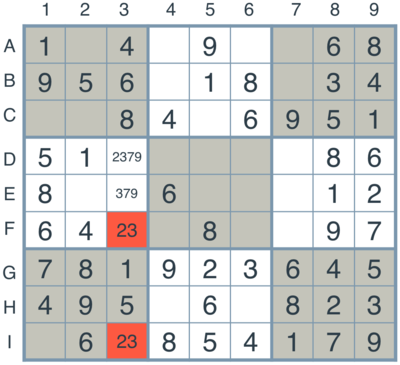

# Artificial Intelligence Nanodegree
## Introductory Project: Diagonal Sudoku Solver

# Question 1 (Naked Twins)
Q: How do we use constraint propagation to solve the naked twins problem? <br />
As illustrated in the following picture, naked twins problem is about using "naked twin squares" (e.g. the two boxes containing 23 highlighted in orange in the following picture) to exclude possibilities in other boxes. In this regard, constraint propagation solves the naked twins problem by "repeatedly" eliminating impossible values of each box according to its peers (row, column and its corresponding square). 
<br /><br />


# Question 2 (Diagonal Sudoku)
Q: How do we use constraint propagation to solve the diagonal sudoku problem?  <br />
The diagonal sudoku problem is just a variant of the above problem if we add the diagonal units as the peer of each other.

### Install

This project requires **Python 3**.

We recommend students install [Anaconda](https://www.continuum.io/downloads), a pre-packaged Python distribution that contains all of the necessary libraries and software for this project. 
Please try using the environment we provided in the Anaconda lesson of the Nanodegree.

##### Optional: Pygame

Optionally, you can also install pygame if you want to see your visualization. If you've followed our instructions for setting up our conda environment, you should be all set.

If not, please see how to download pygame [here](http://www.pygame.org/download.shtml).

### Code

* `solution.py` - You'll fill this in as part of your solution.
* `solution_test.py` - Do not modify this. You can test your solution by running `python solution_test.py`.
* `PySudoku.py` - Do not modify this. This is code for visualizing your solution.
* `visualize.py` - Do not modify this. This is code for visualizing your solution.

### Visualizing

To visualize your solution, please only assign values to the values_dict using the ```assign_values``` function provided in solution.py

### Submission
Before submitting your solution to a reviewer, you are required to submit your project to Udacity's Project Assistant, which will provide some initial feedback.  

The setup is simple.  If you have not installed the client tool already, then you may do so with the command `pip install udacity-pa`.  

To submit your code to the project assistant, run `udacity submit` from within the top-level directory of this project.  You will be prompted for a username and password.  If you login using google or facebook, visit [this link](https://project-assistant.udacity.com/auth_tokens/jwt_login for alternate login instructions.

This process will create a zipfile in your top-level directory named sudoku-<id>.zip.  This is the file that you should submit to the Udacity reviews system.

